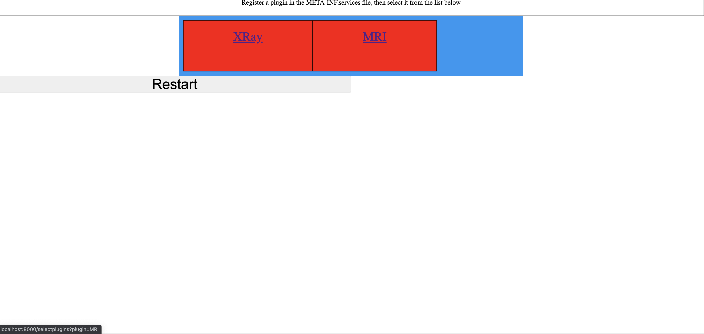
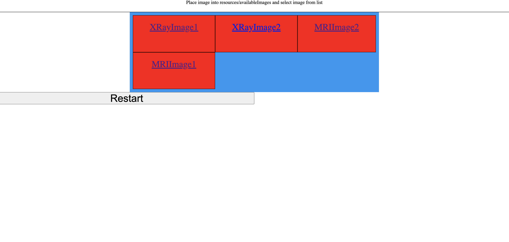
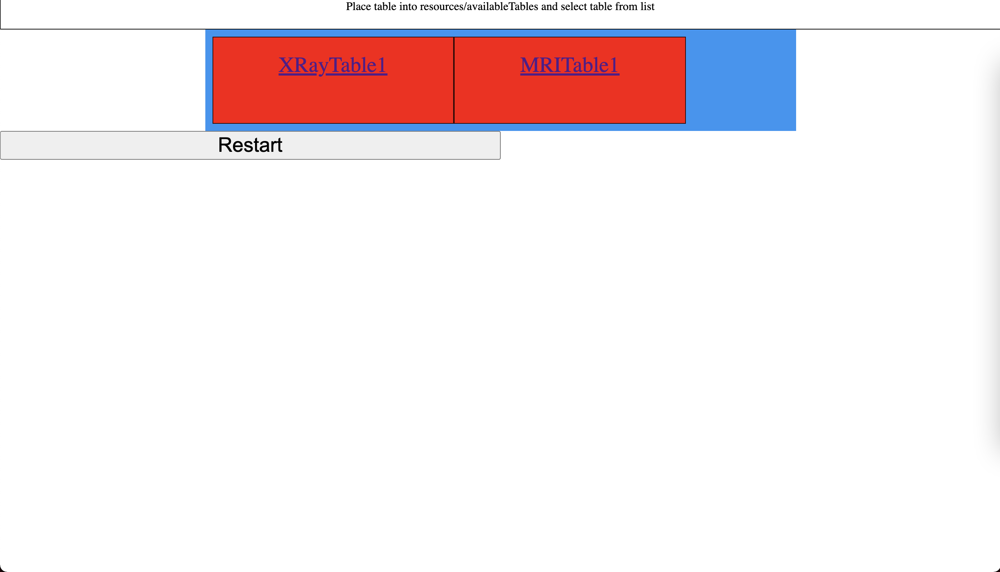
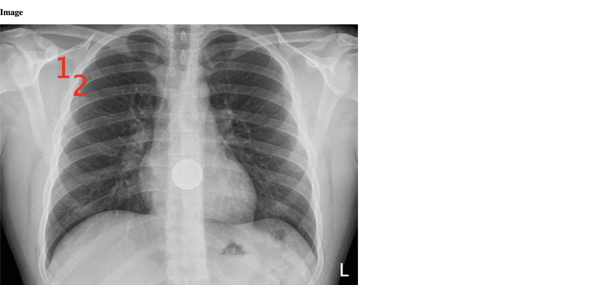
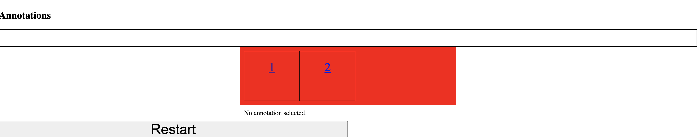
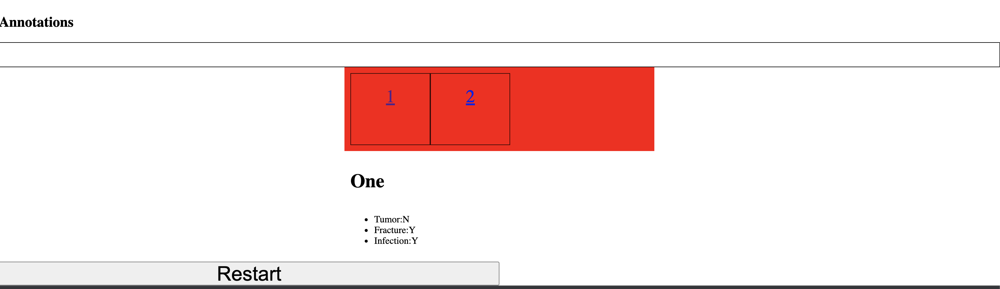
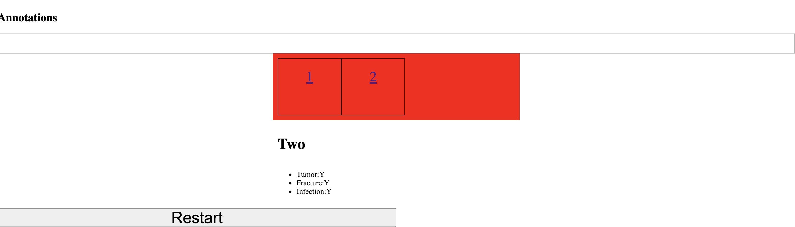

# medannot
## Introduction
### Description
Our framework supports image annotation, and we are focusing on  medical images specifically. We allow our clients to design plugins that generate custom annotations for medical images. For example, an X-Ray plugin might implement annotating an X-Ray image with different kinds of 
information, such as fracture severity, bone size, etc. Hence, our data plugins are images that need to be annotated, and tables containing information about which pixel coordinates in the image to annotate, as well as relevant fields to generate the annotations. 

Our data plugins are tables that must contain a field for x and y coordinates, and a title field. The other fields are variable and 
they will be used by the display plugins. Only the target pixels need to be defined in the data plugins. 

For example, we can have an X-Ray plugin that takes in data plugins which are tables and contain the fields x-coordinate, y-coordinate, Title, Fracture, and Date. Notice that in Table 1 below, we have the fields x-coordinate, y-coordinate, Title, Fracture, Tumor, and Date. Table 1 will be accepted by our X-Ray plugin because it contains all the necessary fields that the plugin requires, and the extra Tumor field will be ignored. Then, we will take in an image with resolution m x n such that for all integer x-coordinates x and integer y-coordinates y in the data table Table 1, 
0 <= x < m and 0 <= y < n. 

##Instruction
###Setup
####Basic Setup
Make sure you have SSH login set up for your local machine. If not, follow these instructions from https://docs.github.com/en/authentication/connecting-to-github-with-ssh. 

If you do not have maven installed on your computer, install maven on your local machine from https://maven.apache.org/install.html.

Once that has been completed, run the following commands on your command line:
```
git clone https://github.com/CMU-17-214/hw6-analytics-framework-medannot.git

cd hw6-analytics-framework-medannot
```

Once you are in the repository directory, you can build your own plugin or use our pre-built XRay and MRI plugins!

####Add Image
Select images based on whatever you want to annotate, and make sure the images's size are within 4096 * 4096, and format them in png extension.

Rememeber to put them in the directory: src/main/resources/availableImages

####Add Table
Select Tables based on your target annotations. For example, in the XRay plugin, we need the Tumor, Fracture and Infection fields. 
If for some (x, y) coordinates we want to annotate that coordinate with some annotations for each field, we place an entry in the table 
with xCoordinate containing the x value, the y coordinate containing the y value, and the rest of the fields containing their respective values 
for that annotation. Note that the xCoordinate, yCoordinate and title fields are mandatory. 

Rememeber to put them in the directory: src/main/resources/availableTables

| xCoordinate | yCoordinate | Title | Fracture | Tumor | Infection |
|-------------|-------------|-------|----------|-------|-----------|
|             |             |       |          |       |           |
|             |             |       |          |       |           |
|             |             |       |          |       |           |

####Create Plugin
The Framework will call the AnnotPlugin functions. The plugins implementing the AnnotPlugin interface must match the specifications. 

```java
public interface AnnotPlugin {
    /**
     * A function to check whether a given data table has all the required fields that will be used by the plugin.
     * @param data The data table to check for
     * @return {@code} if the table contains all the required fields, {@code false} otherwise.
     */
    boolean isTableValid(Table data);

    /**
     * A function to check whether a given Pair(x, y) coordinate is a target i.e. a location to be annotated in the image.
     * @param pair The coordinates to check for
     * @param data The data table to check against
     * @return {@code true} if Pair(x, y) is a target, {@code false} otherwise
     */
    boolean isTarget(Pair pair, Table data);

    /**
     * A function that returns an integer corresponding to the target number in the image.
     * The image is annotated by the Framework where the numbers are placed at the target coordinates Pair(x, y)
     * given as input. Then, the Framework renders buttons below the image with the same numbers as the
     * ones used to annotate the image.
     * @param pair The coordinates to mark with the number
     * @return an {@link Integer} value if Pair(x, y) is a target, {@code null} otherwise
     */
    Integer getNumberForCoordinate(Pair pair, Table data);

    /**
     * A function to generate the HTML formatting for the annotation at some target coordinates
     * @param pair The coordinates
     * @param data The data table to check against
     * @return A {@link String} corresponding to the HTML of the annotation at Pair(x, y) if
     * {@code isTarget(x, y, data)} is {@code true}, {@code null} otherwise.
     */
    String getHTMLForTarget(Pair pair, Table data);

    /**
     * Return the font size to be rendered at the target coordinate location in the image.
     * @param pair the x, y coordinates
     * @param image the input image
     * @param data the input table
     * @return the font size of the target
     */
    Integer getFontSizeForCoordinate(Pair pair, Image image, Table data);

    /**
     * Return the font style (e.g: Font.BOLD, Font.PLAIN) to be rendered at the target coordinate location in the
     * image.
     * @param pair the x, y coordinates
     * @param image the input image
     * @param data the input table
     * @return the font style of the target (Refer to: https://docs.oracle.com/javase/7/docs/api/java/awt/Font.html)
     */
    Integer getFontStyleForCoordinate(Pair pair, Image image, Table data);

    /**
     * Return the font Name (e.g: TimesRoman) to be rendered at the target coordinate location in the image.
     * @param pair the x, y coordinates
     * @param image the input image
     * @param data the input table
     * @return the font Name of the target (Refer to: https://docs.oracle.com/javase/7/docs/api/java/awt/Font.html)
     */
    String getFontNameForCoordinate(Pair pair, Image image, Table data);

    /**
     * Return the font color (e.g: Color.WHITE) to be rendered at the target coordinate location in the image.
     * @param pair the x, y coordinates
     * @param image the input image
     * @return the font color of the target (Refer to: https://docs.oracle.com/javase/7/docs/api/java/awt/Color.html)
     */
    Color getColorForCoordinate(Pair pair, Image image);

    String getPluginName();
}

```

Make sure the plugin you implement matches the specifications above. Check our example plugins XRay.java and MRI.java for additional guidance.

We expose the following APIs for Table and Image. Select methods have been exposed and have been documented below for both classes. 
For the Table class:

```java
public class Table {
    /**
     * Constructor for {@link Table}.
     * @param filePath a {@link String} of the filePath to the csv file. Start the filePath from src folder.
     * @throws TableError.EmptyCSV if the CSV file is empty i.e. no rows
     * @throws TableError.InvalidFile if the file does not exist at the specified location, or is not a CSV
     * @throws TableError.MissingCoreFields if any of the core fields xCoordinate, yCoordinate, and Title is missing.
     */
    public Table(String filePath) throws TableError.EmptyCSV, TableError.InvalidFile, TableError.MissingCoreFields; 

    /**
     * Obtains the parameters for the target at the pair = (x, y) location in the image.
     * @param pair the coordinates
     * @return a {@link HashMap} mapping the other parameters to their values if pair = (x, y) is a target in the table,
     * and returns {@code null} otherwise.
     */
    public Map<String, String> getParams(Pair pair); 

    /**
     * Gets a set of all the field names except xCoordinate and yCoordinate.
     * @return A {@link Set} object containing the names of all the fields in table except the xCoordinate and
     * yCoordinate names.
     */
    public Set<String> getFields(); 

    /**
     * getter for all the targets in this {@link Table}. A target is defined as a
     * an (x, y) coordinate pair for which there is an entry in the table.
     * @return a {@link List} of the targets encoded as {@link Pair} objects.
     */
    public List<Pair> getTargets();
}
```

and for the Image class:

```java
public class Image {
    /**
     * Takes in the width, height, and filepath as input
     *
     * @param width  The maximum supported image width
     * @param height  The maximum supported image height
     * @param filePath The image file path, specified starting from src.
     *
     */
    public Image(int width, int height, String filePath) throws ImageError.InvalidImage;

    /**
     * Takes in x, y coordination, target number, and the customized parameters for the annotation text. Queues a number n to be added at (x, y) on the image.
     *
     * @param x  The value for x coordinate
     * @param y  The value for y coordinate
     * @param n   The target number
     * For Font customization, please refer to:  https://docs.oracle.com/javase/7/docs/api/java/awt/Font.html
     * @return {@code true} if (x, y) is within image target, {@code false} otherwise
     */
    public Boolean addNumber(int x, int y, int n, String FontName, int FontStyle, int fontSize, Color color);

    /**
     * Get the image width
     *
     * @return image width
     */
    public int getWidth();

    /**
     * Get the image height
     *
     * @return image height
     */
    public int getHeight();

    /**
     * Uses the previously added numbers on different targets, then renders a new output image in renderedImages/rendered.png within the resources folder, 
     * that now contains all the numbers written to the specified target coordinates using the specified Font styling. 
     *
     */
    public void render();

}
```

After you implementing your plugin, remember to register it in the
src/main/resources/META-INF/services/edu.cmu.cs.cs214.medannot.framework.core.AnnotPlugin file, and
add the fully qualified name for your plugin in that file.


### Running the App
When you want to run the App, run the following commands on your command line from within the hw6-analytics-framework-medannot directory:
```
mvn clean install

```

and after the above command has finished executing, run:
```
mvn compile exec:java -Dexec.mainClass="edu.cmu.cs.cs214.medannot.App"

```

And then, go to http://localhost:8000/ on your browser

You are ready to run your plugin!


### Example workflow using XRay Plugin
1. Select the XRay Plugin (first option in the window).
   
   
2. Select XRayImage1 (first option in the window).
   

3. Select XRayTable1 (first option in the window).
   

4. You will see the following rendered image, without any annotation selected. 
   
   
   
5. Select Annotation 1, and you will see the image below:
   
   

6. Select Annotation 2, and you will see the image below:
   
   

7. Pressing the Restart button will take you back to step 1. 


