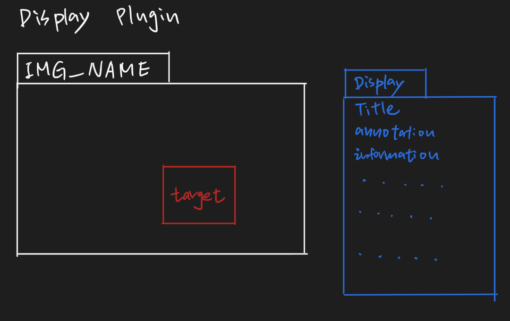

# Design Document
## Domain
### Description
Our framework supports image annotation, and we are focusing on  medical images specifically. We allow our clients to design plugins that generate custom annotations for medical images. For example, an X-Ray plugin might implement annotating an X-Ray image with different kinds of 
information, such as fracture severity, bone size, etc. Hence, our data plugins are images that need to be annotated, and tables containing information about which pixel coordinates in the image to annotate, as well as relevant fields to generate the annotations. 

Our data plugins are tables that must contain a field for x and y coordinates, and a title field. The other fields are variable and 
they will be used by the display plugins. Only the target pixels need to be defined in the data plugins. 

For example, we can have an X-Ray plugin that takes in data plugins which are tables and contain the fields x-coordinate, y-coordinate, Title, Fracture, and Date. Notice that in Table 1 below, we have the fields x-coordinate, y-coordinate, Title, Fracture, Tumor, and Date. Table 1 will be accepted by our X-Ray plugin because it contains all the necessary fields that the plugin requires, and the extra Tumor field will be ignored. Then, we will take in an image with resolution m x n such that for all integer x-coordinates x and integer y-coordinates y in the data table Table 1, 
0 <= x < m and 0 <= y < n. 

#### Table 1
| x-coordinate | y-coordinate | Title | Fracture | Tumor | Date |
|--------------|--------------|-------|----------|-------|------|
|              |              |       |          |       |      |
|              |              |       |          |       |      |
|              |              |       |          |       |      |

## Generality vs. Specificity
### Domain Engineering
Our framework is specific with regards to the fact that we are creating an image annotation tool that is focused on medical annotations. It may be used for other image annotation purposes, but we are creating this project based on the assumption that it will be used for medical purposes, and future extensions may not guarantee that more general image annotation purposes will be supported. 

Our framework is general with regards to the fact that we are allowing for a wide range of images to be annotated, such as X-Ray images, MRI scans, CT scans, EEG diagrams, EKG diagrams, to name but a few. We also support different annotation formats within our display plugins, in that our clients may decide to make a certain text string in a particular font to emphasize certain data, highlighting different texts, or reducing the font size of certain strings, etc. 
### Key Abstractions
Our framework assumes that the data consist of an image file (jpeg) and a data table (json). We require that the table contain some required fields such as, in the example given in the description, our X-Ray plugin requires x-coordinate, y-coordinate, Title, Fracture, and Date fields to be in the data table, Table 1. Furthermore, we require that for the given image with resolution m x n, we have for all integer x-coordinates x and integer y-coordinates y in the data table Table 1, 
0 <= x < m and 0 <= y < n. 

### Reusable Functionality
Our framework may be used by different medical departments. For example, the oncology department might use our framework to highlight tumor areas or annotate CT/MRI scans to indicate tumors in a given image. Our framework may also be used by orthopedic department might use our framework to annotate X-Ray diagrams to indicate fractures in X-Ray images. 

### Flexibility of Plugins
Once an X-Ray plugin has been developed, for example, it might be used to annotate multiple X-Ray images using various Tables that indicate different locations of fractures. Our display plugins thus allow for multiple datasets consisting of images and tables to be processed into annotated images. 


## Folders Treeview

- src
    - edu.cmu.cs.cs214.medannot
        - framework
            - core
                - AnnotFramework (Interface)
                - AppPlugin (Interface)
            - gui
                - imageselector
                - pluginselector
                - tableselector
                - visualizer
            - plugin
                - XRayPlugin (source)
                - MRIPlugin (source)
            - main (source)
    - resources
        - META-INF.services
            - edu.cmu.cs.cs214.medannot.framework.core.AppPlugin

## Details:

### Framework:

The `framework` package contains two sub-packages: the `core` package and `gui` package. The `core` folder have the interface for Applications's framework, plugin and change listener. Details of implementation would be inside the `AppFramworkImpl` source file. Since we want to decouple the gui from core logic, those implementation for user interface would be in `gui` folder's source file.

### Plugin:

The `plugin` package contains the details implementation of different application plugin. Now the two applications we support are XRay and MRI pictures annotation. 

### main:

Code for create and start the framework, then load all the implemented plugins.

### edu.cmu.cs.cs214.hw6.framework.core.AppPlugin:

List of plugins to be registered by framework

## Key Data Structure

### Input:

1. image filepath
2. Table.csv / json 

#### example of table
| x-coordinate | y-coordinate | Title | Annotate information |
|--------------|--------------|-------|----------------------|
|              |              |       |                      |
|              |              |       |                      |
|              |              |       |                      |

Output:

1. HTML for handlebar display
2. Rendered image 

#### example of rednered image on display plugin


## Plugin Interfaces:
We first provide the plugin interface for the Design Plugins:

```
public interface AnnotPlugin {
    /**
    * A function to check whether a given data table has all the required fields that will be used by the plugin.
    * @param data The data table to check for
    * @return {@code} if the table contains all the required fields, {@code false} otherwise.
    */
    boolean isTableValid(Table data);

    /**
     * A function to check whether the given dimensions of an image can fit the target coordinates in the table data.
     * @param m Height of image
     * @param n Width of image
     * @param data The data table to check for
     * @return {@code true} if the image and the table are consistent, {@code false} otherwise
     */
    boolean isImageValid(int m, int n, Table data);

    /**
     * A function to check whether a given (x, y) coordinate is a target i.e. a location to be annotated in the image.
     * @param x The x-coordinate
     * @param y The y-coordinate
     * @param data The data table to check against
     * @return {@code true} if (x, y) is a target, {@code false} otherwise
     */
    boolean isTarget(int x, int y, Table data);
    
    /**
     * A function that returns an integer corresponding to the target number in the image
     * @param x The x-coordinate
     * @param y The y-coordinate
     * @return an {@link Integer} value if (x, y) is a target, {@code null} otherwise
     */
    Integer getNumberForCoordinate(int x, int y);

    /**
     * A function to compute the HTML formatting for the annotation at some target coordinates
     * @param x The x-coordinate
     * @param y The y-coordinate
     * @param data The data table to check against
     * @return A {@link String} corresponding to the HTML of the annotation at (x, y) if {@code isTarget(x, y, data)} is
     *  {@code true}, {@code null} otherwise.
     */
    String getHTMLForTarget(int x, int y, Table data);
}
```

We have also provided an interface for our framework:
```
public interface AnnotFramework {
    /**
     * Takes in the input image which is an m x n png file that is converted using a Table of the data and
     * the relevant plugin to an annotated image diagram.
     * @param image The image to process
     * @param data The data table based on which the plugin will create the annotations in the image
     * @param plugin The plugin that will process the data and the table to produce the image
     * @return {@code true} if the render was successful, {@code false} otherwise
     */
    Boolean render(Image image, Table data, AnnotPlugin plugin);
}
```

Note that our framework does not expose any methods other than the render method, which is because unlike the 
recitation handout code for Recitation 10, our framework will only call into the client code provided by the 
plugin, and the methods for the framework cannot be called by the plugin. We believe that this a better implementation
for our framework and plugin interfaces, given that frameworks are supposed to call into client code and not the other 
way around. 